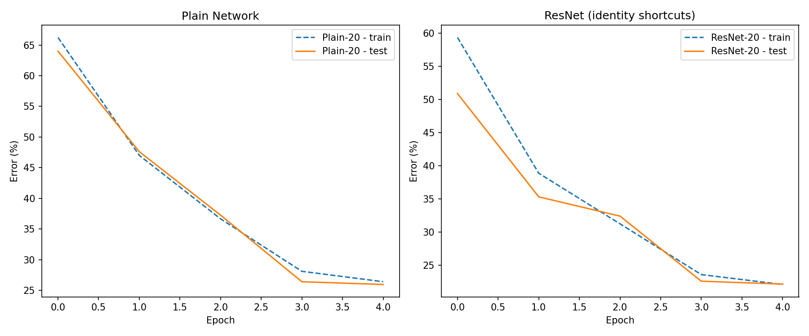

# ResNet on CIFAR-10 — PyTorch Implementation


A comprehensive PyTorch implementation and code walkthrough of **Deep Residual Learning for Image Recognition** (He et al., 2015), focusing on the CIFAR-10 experiments. This repository contains a detailed Jupyter notebook that implements both a **plain convolutional network** and its **residual (ResNet) counterpart** using identical building blocks, enabling a controlled comparison.

---

## 📋 Table of Contents

- [Overview](#overview)
- [Notebook Structure](#notebook-structure)
- [Key Results](#key-results)
- [Architecture](#architecture)
- [Mathematical Foundation](#mathematical-foundation)
- [Installation](#installation)
- [Usage](#usage)
- [Requirements](#requirements)
- [References](#references)

---

## 🎯 Overview

This notebook implements, in PyTorch, the two architectures compared in He et al.'s *Deep Residual Learning for Image Recognition* (Section 4.2, CIFAR-10 experiment):

1. **Plain Convolutional Network** — A standard feedforward CNN baseline
2. **ResNet** — The same architecture with identity shortcut connections

Both networks are built from **exact same building blocks** so that the only difference is the presence of identity shortcut connections, guaranteeing an identical layer structure and parameter count — exactly the controlled comparison the paper relies on.

---

## 📓 Notebook Structure

| Section | Description |
|---------|-------------|
| **1. Data Pipeline** | CIFAR-10 loading, augmentation, normalization |
| **1.1 Data Exploration** | Visualization of sample images and class distribution |
| **2. Residual Block** | `BasicBlock` implementation with Option A/B shortcuts |
| **3. Full Network** | `ResNetCIFAR` class assembling 6n+2 layer architecture |
| **3.1 Architecture Visualization** | Layer-by-layer tensor shape analysis |
| **4. Training Functions** | Training loop and evaluation utilities |
| **5. Training Execution** | Side-by-side training of Plain-20 vs ResNet-20 |
| **5.1 Results Tables** | Epoch-by-epoch metrics comparison |
| **5.2 Prediction Examples** | Sample predictions with confidence scores |
| **6. Training Curves** | Loss and error visualization |
| **7. Scaling Notes** | Instructions for reproducing paper's Table 6 |
| **8. Oral Summary** | Key concepts summary (French) |

---

## 📊 Key Results

### Final Test Error Comparison

| Model | Parameters | Test Error |
|-------|------------|------------|
| **Plain-20** | 269,722 | 25.97% |
| **ResNet-20** | 269,722 | **22.13%** |

> **Note:** Both models have identical parameter counts (269,722) because Option A shortcuts add zero parameters.

### Training Progress (5 Epochs)

| Epoch | Plain-20 Test Error | ResNet-20 Test Error |
|-------|---------------------|----------------------|
| 1 | 64.00% | 50.90% |
| 2 | 47.62% | 35.30% |
| 3 | 37.27% | 32.39% |
| 4 | 26.42% | 22.56% |
| 5 | **25.97%** | **22.13%** |



---

## 🏗️ Architecture

### ResNet-20 for CIFAR-10 (6n+2 layers, n=3)

```
Input (3 × 32 × 32)
    ↓
Conv1: 3×3, 16 filters + BatchNorm + ReLU → (16 × 32 × 32)
    ↓
Layer 1: 3 × BasicBlock(16) → (16 × 32 × 32)
    ↓
Layer 2: 3 × BasicBlock(32, stride=2) → (32 × 16 × 16)
    ↓
Layer 3: 3 × BasicBlock(64, stride=2) → (64 × 8 × 8)
    ↓
Global Average Pooling → (64 × 1 × 1)
    ↓
Flatten → (64)
    ↓
FC Layer → (10 classes)
```

### BasicBlock Implementation

```python
class BasicBlock(nn.Module):
    expansion = 1

    def __init__(self, in_planes, planes, stride=1, use_shortcut=True, option="A"):
        super().__init__()
        self.use_shortcut = use_shortcut

        self.conv1 = nn.Conv2d(in_planes, planes, kernel_size=3, 
                               stride=stride, padding=1, bias=False)
        self.bn1 = nn.BatchNorm2d(planes)
        self.conv2 = nn.Conv2d(planes, planes, kernel_size=3, 
                               stride=1, padding=1, bias=False)
        self.bn2 = nn.BatchNorm2d(planes)

        self.shortcut = nn.Sequential()
        if use_shortcut and (stride != 1 or in_planes != planes):
            if option == "A":
                # Option A: Zero-padding + striding (no parameters)
                pad = planes - in_planes
                self.shortcut = LambdaLayer(
                    lambda x: F.pad(x[:, :, ::stride, ::stride], 
                                    (0, 0, 0, 0, 0, pad))
                )
            else:
                # Option B: 1×1 conv projection (learned)
                self.shortcut = nn.Sequential(
                    nn.Conv2d(in_planes, planes, kernel_size=1, 
                              stride=stride, bias=False),
                    nn.BatchNorm2d(planes),
                )

    def forward(self, x):
        out = F.relu(self.bn1(self.conv1(x)))
        out = self.bn2(self.conv2(out))
        if self.use_shortcut:
            out = out + self.shortcut(x)
        out = F.relu(out)
        return out
```

### Shortcut Options

| Option | Method | Parameters | Description |
|--------|--------|------------|-------------|
| **A** | Zero-padding + striding | 0 | Default for CIFAR-10 (paper's choice) |
| **B** | 1×1 conv + BatchNorm | Yes | Learned projection |

---

## 📐 Mathematical Foundation

### Residual Learning Hypothesis

The core hypothesis of ResNet is that fitting a residual mapping $\mathcal{F}(x)$ is easier than directly learning an unreferenced target mapping $\mathcal{H}(x)$.

$$\mathcal{F}(x) := \mathcal{H}(x) - x \implies \mathcal{H}(x) = \mathcal{F}(x) + x$$

### Building Block Equation

For a two-layer residual block:

$$y = \sigma\Big(\mathcal{F}(x, \{W_i\}) + x\Big)$$

where $\mathcal{F} = W_2 \, \sigma(W_1 x)$, $\sigma$ represents ReLU, and $x$ is the identity shortcut.

### Dimension Matching (Option B)

When feature map dimensions change:

$$y = \sigma\Big(\mathcal{F}(x, \{W_i\}) + W_s x\Big)$$

where $W_s$ is a 1×1 convolution projection.

---

## 🚀 Installation

### Clone the Repository

```bash
git clone https://github.com/SohayebGasmi-IA79/ResNet_TEST.git
cd ResNet_TEST
```

### Create Virtual Environment (Recommended)

```bash
python -m venv venv
source venv/bin/activate  # Linux/Mac
# or
venv\Scripts\activate     # Windows
```

### Install Dependencies

```bash
pip install torch torchvision matplotlib numpy pandas jupyter
```

---

## 💻 Usage

### Run the Notebook

```bash
jupyter notebook code_explained_resnet.ipynb
```

### Quick Training Script

```python
import torch
import torch.nn as nn
from code_explained_resnet import ResNetCIFAR, train_model

# Device configuration
device = torch.device("cuda" if torch.cuda.is_available() else "cpu")

# Create models
N_BLOCKS = 3  # n=3 → 6n+2 = 20 layers
resnet = ResNetCIFAR(n=N_BLOCKS, use_shortcut=True).to(device)
plainnet = ResNetCIFAR(n=N_BLOCKS, use_shortcut=False).to(device)

# Train
history_resnet = train_model(
    resnet, train_loader, test_loader,
    epochs=5, lr_milestones=[3, 4], name="ResNet-20"
)
```

### Reproduce Paper's Table 6

```python
# Change N_BLOCKS for different depths
# n=3 → ResNet-20
# n=5 → ResNet-32
# n=7 → ResNet-44
# n=9 → ResNet-56
# n=18 → ResNet-110

EPOCHS_PAPER = 91
LR_MILESTONES_PAPER = [82, 123]  # Note: epochs > 91 for full schedule
```

---

## 📦 Requirements

```
torch>=2.0.0
torchvision>=0.15.0
matplotlib>=3.5.0
numpy>=1.21.0
pandas>=1.4.0
jupyter>=1.0.0
```

### Hardware Recommendations

| Configuration | Training Time (5 epochs) |
|---------------|--------------------------|
| CPU (Intel i7) | ~30 minutes |
| GPU (NVIDIA GTX 1060) | ~5 minutes |
| GPU (NVIDIA RTX 3080) | ~2 minutes |

---

## 📁 Project Structure

```
ResNet_TEST/
├── code_explained_resnet.ipynb    # Main notebook with full walkthrough
├── data/
│   ├── cifar-10-batches-py/       # CIFAR-10 dataset (auto-downloaded)
│   │   ├── batches.meta
│   │   ├── data_batch_1
│   │   ├── data_batch_2
│   │   ├── data_batch_3
│   │   ├── data_batch_4
│   │   ├── data_batch_5
│   │   ├── readme.html
│   │   └── test_batch
│   └── cifar-10-python.tar.gz
├── plain_vs_resnet_comparison.png # Training curves visualization
└── README.md                       # This file
```

---

## 🔬 Key Implementation Details

### Data Augmentation

```python
transform_train = transforms.Compose([
    transforms.RandomCrop(32, padding=4),      # 4-pixel padding + random crop
    transforms.RandomHorizontalFlip(),          # Random horizontal flip
    transforms.ToTensor(),
    transforms.Normalize(MEAN, STD),            # CIFAR-10 per-channel normalization
])

MEAN = (0.4914, 0.4822, 0.4465)
STD = (0.2470, 0.2435, 0.2616)
```

### Training Hyperparameters

| Parameter | Value |
|-----------|-------|
| Optimizer | SGD |
| Learning Rate | 0.1 |
| Momentum | 0.9 |
| Weight Decay | 1e-4 |
| Batch Size | 128 |
| LR Schedule | MultiStepLR (÷10 at milestones) |

### Weight Initialization

```python
def _init_weights(self):
    for m in self.modules():
        if isinstance(m, nn.Conv2d):
            nn.init.kaiming_normal_(m.weight, mode="fan_out", 
                                    nonlinearity="relu")
        elif isinstance(m, nn.BatchNorm2d):
            nn.init.constant_(m.weight, 1)
            nn.init.constant_(m.bias, 0)
```

---

## 📚 References

1. **He, K., Zhang, X., Ren, S., & Sun, J.** (2016). Deep Residual Learning for Image Recognition. *CVPR 2016*. [arXiv:1512.03385](https://arxiv.org/abs/1512.03385)

2. **Krizhevsky, A.** (2009). Learning Multiple Layers of Features from Tiny Images. *Technical Report*.

3. **PyTorch Documentation**: [https://pytorch.org/docs/](https://pytorch.org/docs/)

---


## 📧 Contact

**Sohayeb Gasmi** — [GitHub Profile](https://github.com/SohayebGasmi-IA79)

Project Link: [https://github.com/SohayebGasmi-IA79/ResNet_TEST](https://github.com/SohayebGasmi-IA79/ResNet_TEST)

---

<p align="center">
  <b>⭐ Star this repository if you found it helpful!</b>
</p>